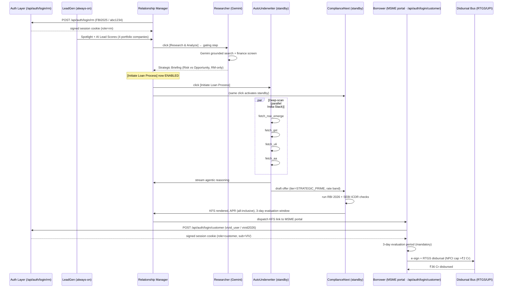

# AgentLoanNext — Antigravity Agent Manifest

> **Bank:** Future Bank of India · *Innovating the Indian Dream*
> **Product:** AgentLoanNext — RM-Led Agentic Lending Cockpit
> **Stack:** Antigravity orchestration · FastAPI rails · React/Tailwind cockpit · GCP Cloud Run (`asia-south1`)
> **Spotlight Borrower:** Vivid Electromech Limited (NSE Emerge listed, Mumbai MIDC manufacturer)

This manifest is the canonical contract Antigravity loads to spin up the **five** agents that
power the RM cockpit. Unlike the prior fully-autonomous prototype, the bank's policy now
requires a **human-in-the-loop** model: the RM is the executive — the agents are advisors
that wait for an explicit `Initiate` click before performing any deep-rail validation.

> **v3 update — Intelligence & Security:** A new `Researcher` agent (Gemini-backed)
> has been added. The `Initiate` button is now **gated** — it appears only after
> the RM has run a Strategic Briefing on the lead. Authentication is enforced
> via signed session cookies issued by `/api/auth/login/{rm,customer}` and
> verified by middleware on every protected route.
>
> **v4 update — Voice-Command:** A new `Copilot` agent listens for voice intents
> from the RM. Audio captured by the browser's MediaRecorder is uploaded to
> `/api/voice/command`, transcribed via Google Cloud Speech-to-Text, and parsed
> into a structured `{intent, target_company_id}` payload by Gemini. The same
> Research-gate that protects the click-driven `Initiate` also protects the voice
> path — `INITIATE_LOAN` is rejected with a friendly remediation message until
> the RM has researched the target.
>
> **v5 update — Admin Orchestration & Bulk Intelligence:** A new privileged
> `admin` role (FBI_ADMIN) operates a separate Command Center at
> `/admin-dashboard`. Two new agents support the bulk workflow: `Batch-Researcher`
> runs concurrent Gemini-powered briefings for every portfolio company on demand,
> and `State-Sync` writes the resulting "Admin Intelligence Packs" into a shared
> store that the RM cockpit reads on next render. The RM's "Initiate Loan"
> authority is unchanged: admin-sourced briefings are *advisory*, and the RM
> remains the final human-in-the-loop sanctioning authority — they can run their
> own RM Deep-Dive (click or voice) before clicking Initiate if they want fresher
> data.

---

## 1. Shared Context

```yaml
program: agentloannext
operator: Future Bank of India
brand:
  primary_blue: "#0047FF"      # Electric Blue
  primary_teal: "#00BFA5"      # Transformative Teal
  neutrals: warm_grey
  tagline: "Innovating the Indian Dream."
  logo: "stylized 'F' integrated with a digital circuit pulse"
region: asia-south1
locale: en-IN
default_currency: INR
governance:
  rbi_circular: RBI/2026-27/FPC-Digital-Lending
  consent_framework: DEPA 2.0
  human_in_the_loop: true        # RM must approve every deep-scan run
  audit_sink: gs://fbi-agentloannext-audit-2026/
roles:
  rm:                            # Relationship Manager (bank staff)
    portal: /rm-dashboard
    auth: SSO + role-claim "rm"
    decision_gate: true          # final human-in-the-loop authority on sanctioning
  borrower:                      # MSME promoter
    portal: /msme-portal
    auth: AA-linked OTP + DigiLocker e-sign
  admin:                         # Bank-wide operations (privileged-access)
    portal: /admin-dashboard
    auth: SSO + role-claim "admin"
    capabilities: [bulk_research, vault_view, audit_read]
    cannot: [sanction, disburse, esign_on_behalf]   # admin advises, never sanctions
data_planes:
  - name: NSE Emerge filings
    endpoint: /api/mock/nse_emerge
    purpose: corporate actions, IPO listings
  - name: GSTN
    endpoint: /api/mock/gst
    purpose: filing hygiene, sales velocity
  - name: ULI
    endpoint: /api/mock/uli
    purpose: collateral verification
  - name: AA (Sahamati)
    endpoint: /api/mock/aa
    purpose: bank cash-flow, working-capital gap
```

---

## 2. Agent Roster

### 2.1 `LeadGen` — Always-On Opportunity Scanner

```yaml
id: leadgen
type: continuous_signal_miner
model: claude-haiku-4-5
priority: P1
mode: ALWAYS_ON
cadence: every 6 hours per portfolio company
inputs:
  - nse_emerge_filings_feed
  - gst_velocity_stream
  - aa_inflow_pulse
outputs:
  - lead_score        # 0-100, RM-facing
  - alert_summary     # one-line headline for the spotlight card
  - recommendation    # Initiate | Monitor | Follow-up
heuristics:
  - signal: ipo_listing_event
    weight: 30
    threshold: principal_listed >= 50_00_00_000   # ₹50 Cr+
  - signal: gst_yoy_growth
    weight: 25
    threshold: pct >= 35
  - signal: working_capital_gap
    weight: 25
    derivation: gst_velocity_demand - aa_inflow_supply
  - signal: filing_hygiene
    weight: 20
    threshold: score >= 90
example_alert: |
  AutoNavigator detected a ₹130 Cr IPO listing and 74% Sales Growth.
  Underwriter identifies a ₹36 Cr working capital gap.
  Recommendation: Initiate Loan Process.
output_channel: rm_spotlight_bus      # streamed to the AI Spotlight card
guardrails:
  - never auto-disburse; always defer to RM `Initiate`
  - tier == REVIEW alerts must include explanation, not just a score
```

### 2.1a `Copilot` — Voice-Activated Command Router (RM-only)

```yaml
id: copilot
type: voice_intent_router
priority: P1
mode: ON_DEMAND               # triggered when RM clicks the global mic button
audience: rm_only             # not exposed to borrowers
secret_management:
  stt_iam_role: roles/speech.client     # Cloud Run SA gets STT permission
  gemini_api_key_env: GEMINI_API_KEY
inputs:
  - audio_blob                # browser MediaRecorder (webm/opus by default)
  - mime_type
  - researched_set            # forwarded by the React app for gate enforcement
pipeline:
  - step: 1
    name: speech_to_text
    provider: google_cloud_speech_v1
    config:
      language_code: en-IN
      alternative_language_codes: [hi-IN, en-US]
      enable_automatic_punctuation: true
      model: latest_short
  - step: 2
    name: intent_extraction
    provider: google_gemini
    model: ${GEMINI_MODEL:-gemini-1.5-flash}
    schema:
      intent: RESEARCH_COMPANY | INITIATE_LOAN | OPEN_VAULT | OPEN_PORTFOLIO | UNKNOWN
      target_company_id: VIV | SUR | ARZ | BLU | null
      target_company_name: string | null
      confidence: 0.0-1.0
  - step: 3
    name: action_resolution
    rules:
      - intent=RESEARCH_COMPANY → route to /research/{target_company_id}
      - intent=INITIATE_LOAN AND target ∈ researched_set → /rm-dashboard?initiate={id}
      - intent=INITIATE_LOAN AND target ∉ researched_set → 412 with remediation
      - intent=OPEN_VAULT → /admin/vault
      - intent=OPEN_PORTFOLIO → /rm-dashboard
fallbacks:
  - if STT SDK unavailable → return FALLBACK_NO_SDK; UI surfaces error
  - if Gemini key missing → keyword-based regex parser (deterministic)
  - if neither company nor verb detected → UNKNOWN with friendly nudge
guardrails:
  - voice command never auto-disburses; final tap is still required by RM
  - all utterances are logged (transcript + intent) to the audit sink
  - 6 MB / ~30s upload cap to prevent abuse
example_voice_flow: |
  RM (mic): "Initiate loan for Vivid Electromech"
  STT: "initiate loan for vivid electromech"
  Gemini: {intent: INITIATE_LOAN, target_company_id: VIV, confidence: 0.94}
  Copilot: research_gate(VIV) ✓ → /rm-dashboard?initiate=VIV
  RM Cockpit: opens KFS confirm panel (one-tap to proceed)
```

### 2.1c `Batch-Researcher` — High-Concurrency Bulk Intelligence (Admin-only)

```yaml
id: batch_researcher
type: parallel_research_orchestrator
priority: P1
mode: ON_DEMAND               # triggered when admin clicks "Initiate Bulk Research Job"
audience: admin_only          # only the privileged FBI_ADMIN role can launch
trigger_endpoint: POST /api/admin/initiate-batch
inputs:
  - admin_session              # FBI_ADMIN session cookie verified by middleware
  - portfolio_company_ids      # snapshot of /api/portfolio at trigger time
concurrency:
  fan_out: parallel           # asyncio.gather over all portfolio companies
  per_call_provider: google_gemini
  per_call_model: ${GEMINI_MODEL:-gemini-1.5-flash}
  cost_control: 4-hour cache; force_refresh=true on bulk run
state_machine:
  - PENDING   → initial state for each company in the batch
  - RUNNING   → Gemini call in flight
  - DONE      → briefing persisted via State-Sync
  - FAILED    → error captured; batch tagged PARTIAL
job_record:
  fields:
    - id (str, "batch-<uuid>")
    - label "Nightly Intelligence Batch"
    - started_at, started_by, finished_at, duration_ms
    - total, completed, failed
    - status: RUNNING | COMPLETED | PARTIAL | FAILED
    - items: company_id → {status, started_at, finished_at, source, error}
guardrails:
  - never auto-disburse; this agent only writes briefings, never sanctions
  - Gemini API key sourced from Secret Manager (fbi-gemini-api-key); never logged
  - if Gemini quota exhausted, items fall back to curated briefings (source=GEMINI_FALLBACK)
  - bulk runs are idempotent — re-triggering replaces ADMIN_BRIEFINGS atomically
observability:
  - progress polled by /api/admin/batch/{job_id} (admin OR rm)
  - final state available at /api/admin/batch/latest
example_alert: |
  Vikram Rao kicks off batch-9f4a1b2c3d at 22:00 IST.
  4 companies fanned out in parallel; completes in 7.4s.
  All four items marked DONE → State-Sync flips ADMIN_BRIEFINGS atomically.
  RM cockpit on next reload shows "New Admin Updates Available".
```

### 2.1d `State-Sync` — Admin → RM Intelligence Bridge

```yaml
id: state_sync
type: shared_state_manager
priority: P0
mode: PASSIVE                 # invoked by Batch-Researcher when each item finishes
audience: system              # not directly user-facing; surfaced through portfolio + research APIs
storage:
  demo:        in-memory dict (backend/state.py)
  production:  Firestore collection `admin_briefings/{company_id}`
  audit_sink:  gs://fbi-agentloannext-audit-2026/admin-briefings/
contract:
  on_briefing_complete:
    - persist briefing payload + {generated_at, admin_id, batch_id}
    - emit `admin.briefing.updated` event
  read_paths:
    - /api/portfolio                    → adds {admin_research_status, last_admin_update, admin_verified, admin_batch_id}
    - /api/research/{id}?source=admin   → returns the cached admin briefing if any
    - /api/admin/batch/{job_id}         → live progress
freshness:
  FRESH    → < 24h since generated_at
  STALE    → ≥ 24h
  NEVER_RUN → no admin briefing for this company yet
guardrails:
  - admin write paths require role=admin; reads available to admin OR rm
  - admin writes never overwrite RM-side caches in research.py — both layers
    coexist so the RM can choose live vs admin via ?source= query param
  - any write triggers `has_admin_updates` flag for the RM "New Admin Updates
    Available" badge
example_flow: |
  Admin → Initiate Bulk Research Job
  Batch-Researcher → 4× parallel Gemini calls
  State-Sync → writes ADMIN_BRIEFINGS["VIV"], ADMIN_BRIEFINGS["SUR"], …
  RM cockpit reload → portfolio rows show "Admin · 2m ago" pill
  RM clicks pill → /research/VIV?source=admin → Strategic Briefing tagged ADMIN_VERIFIED
  RM may still click "RM Deep-Dive" for a fresh live run before Initiate.
```

### 2.1b `Researcher` — Gemini-Powered Strategic Intelligence (RM-only)

```yaml
id: researcher
type: web_intelligence_synthesizer
model_provider: google_gemini
model: gemini-1.5-flash      # fast, cost-effective; upgrade to gemini-2.0-pro for tier=STRATEGIC_PRIME
priority: P1
mode: ON_DEMAND               # triggered when RM clicks "Research & Analyze"
audience: rm_only             # never surfaced to the borrower
secret_management:
  api_key_env: GEMINI_API_KEY                # injected by Cloud Run from Secret Manager
  secret_name: fbi-gemini-api-key
inputs:
  - company_id                                # VIV | SUR | ARZ | BLU
  - portfolio_card_payload                    # last-known financials from /api/portfolio
  - rm_intent_hint (optional)                 # "due_diligence" | "renewal" | "expansion"
tools:
  - name: gemini_grounded_search
    purpose: web-scale retrieval-augmented synthesis (news, filings, sector reports)
    citations: REQUIRED
  - name: gemini_finance_screen
    purpose: scrape NSE/BSE current price & 30-day move (if listed)
    citations: REQUIRED
contract:
  output_schema: STRATEGIC_BRIEFING_V1
  required_sections:
    - executive_summary           # ≤80 words, "is this lead worth initiating?"
    - risk_vs_opportunity         # balanced ledger, RM's eyes only
    - recent_news                 # 3-5 bullets with citations
    - sector_outlook              # macro tailwinds/headwinds for borrower's NIC code
    - financial_snapshot          # market cap, 30-day move, peer comp
    - red_flags                   # litigation, governance, supply-chain, ESG
    - rm_recommendation           # PROCEED_TO_INITIATE | DEFER | DECLINE + 1-line rationale
  must_cite_sources: true
  hallucination_policy: refuse_to_answer_when_uncertain
state_machine:
  before_research: initiate_button.disabled = true
  after_research:  initiate_button.enabled  = true   # RM still has free will
guardrails:
  - briefing is RM-only — never expose sources/recommendation to borrower
  - all responses cached for 4 hours per company_id (cost control)
  - if Gemini key missing or quota exhausted, fall back to a curated
    deterministic briefing so the RM workflow is never blocked
```

### 2.2 `AutoNavigator` — Conversational + Multimodal Front

```yaml
id: autonavigator
type: multimodal_conversation
model: claude-sonnet-4-6
priority: P0
mode: ON_DEMAND        # only engages once RM clicks Initiate or borrower opens portal
inputs:
  - text   # Hinglish, Devanagari, Roman, regional scripts
  - voice  # Bhashini ASR upstream
  - image  # POs, term sheets, board resolutions
outputs:
  - intent_payload          # → AutoUnderwriter
  - localized_kfs_render    # ← ComplianceNext
  - borrower_acknowledgement
capabilities:
  - bhashini_translate (22 scheduled langs + Hinglish code-mix)
  - po_extraction (OCR + LLM)
  - empathy_layer (vernacular, non-jargon tone)
guardrails:
  - never quote a final rate; defer to ComplianceNext
  - always disclose: "I am an AI agent acting on behalf of Future Bank of India."
```

### 2.3 `AutoUnderwriter` — Standby Deep-Scan Engine

```yaml
id: autounderwriter
type: tool_using_orchestrator
model: claude-opus-4-6
priority: P0
mode: STANDBY          # idle until RM clicks Initiate
activation_event: rm.initiate.clicked
tools:
  - name: fetch_nse_emerge
    endpoint: GET  /api/mock/nse_emerge
    timeout_ms: 4000
  - name: fetch_gst
    endpoint: GET  /api/mock/gst
    timeout_ms: 4000
  - name: fetch_uli
    endpoint: GET  /api/mock/uli
    timeout_ms: 4000
  - name: fetch_aa
    endpoint: GET  /api/mock/aa
    timeout_ms: 6000
  - name: score_borrower
    endpoint: POST /api/underwrite/score
deep_scan_workflow:
  - step: 1
    action: parallel_fetch [fetch_gst, fetch_aa, fetch_uli, fetch_nse_emerge]
  - step: 2
    action: derive_metrics
    metrics:
      - sales_inr_fy_latest
      - gst_yoy_growth_pct
      - filing_hygiene_score
      - roe_pct
      - debt_to_equity
      - working_capital_gap_inr
      - collateral_market_value_inr
      - dscr_projected
  - step: 3
    action: assemble_offer
    rules:
      - if (yoy >= 35 AND hygiene >= 90 AND d_e <= 0.50 AND dscr >= 1.5):
          tier: STRATEGIC_PRIME       # bank's highest-trust tier
          rate_band: [9.25, 10.50]
      - elif (yoy >= 15 AND hygiene >= 85):
          tier: PRIME
          rate_band: [10.75, 12.25]
      - elif (yoy >= 8 AND hygiene >= 75):
          tier: NEAR_PRIME
          rate_band: [12.50, 14.50]
      - else:
          tier: REVIEW
          escalate_to: regional_credit_head
  - step: 4
    action: emit_reasoning_trace      # streamed to RM cockpit + spotlight
broadcast_channel: agentic_trace_bus
```

### 2.4 `ComplianceNext` — Standby RBI 2026 Gate

```yaml
id: compliancenext
type: policy_guardrail
model: claude-opus-4-6
priority: P0
mode: STANDBY
activation_event: underwriter.offer.drafted
authority:
  - RBI Master Direction on Digital Lending, 2025 (revised 2026)
  - Fair Practice Code for Digital Lenders, 2026 v3
  - DEPA 2.0 Consent Artefact Standard
  - SEBI ICDR (for NSE-listed borrowers)
checks:
  - id: KFS_GENERATED
    blocking: true
  - id: APR_ALL_INCLUSIVE
    description: APR must include processing fee, GST on fees, stamp duty, insurance
    blocking: true
  - id: EVALUATION_PERIOD_3D
    description: Mandatory 3-day evaluation/cooling-off explicitly disclosed
    blocking: true
  - id: APR_PROMINENT
    description: APR shown ≥14pt bold on KFS render
    blocking: true
  - id: NO_DARK_PATTERNS
    blocking: true
  - id: GRIEVANCE_OFFICER_LISTED
    blocking: true
  - id: CONSENT_ARTEFACT_VALID
    description: All four consent IDs (NSE/GST/ULI/AA) unexpired & signed
    blocking: true
  - id: LISTED_ENTITY_DISCLOSURE_OK
    description: For NSE-listed borrowers, board resolution + corporate-action sign-off recorded
    blocking: true
kfs_template: ./templates/kfs_v4_all_inclusive.json
output:
  - kfs_pdf_url
  - apr_all_inclusive_pct
  - evaluation_window_ends_at
  - compliance_verdict: PASS | HOLD | BLOCK
veto_power: true
```

---

## 3. RM-Led Workflow (v3 — Research-Gated)



### Event Bus Topics

| Topic                          | Producer        | Consumer(s)                                |
| ------------------------------ | --------------- | ------------------------------------------ |
| `auth.session.issued`          | Auth Layer      | RM Cockpit, MSME Portal                    |
| `lead.scored`                  | LeadGen         | RM Cockpit (portfolio table)               |
| `lead.alert.spotlight`         | LeadGen         | RM Cockpit (AI Spotlight card)             |
| `research.requested`           | RM Cockpit      | Researcher (Gemini)                        |
| `research.briefing.ready`      | Researcher      | RM Cockpit (Strategic Briefing pane)       |
| `rm.initiate.clicked`          | RM Cockpit      | AutoUnderwriter, ComplianceNext            |
| `data.{nse,gst,uli,aa}.fetched`| AutoUnderwriter | ComplianceNext, RM trace pane              |
| `underwriter.offer.drafted`    | AutoUnderwriter | ComplianceNext                             |
| `kfs.generated`                | ComplianceNext  | RM Cockpit, MSME portal                    |
| `borrower.evaluation.started`  | MSME portal     | RM Cockpit                                 |
| `borrower.esigned`             | MSME portal     | Disbursal Bus                              |
| `disbursal.confirmed`          | Disbursal Bus   | All agents (audit log → WORM)              |

---

## 4. Failure Modes & Fallbacks

| Failure                                 | Detection                | Fallback                                                                          |
| --------------------------------------- | ------------------------ | --------------------------------------------------------------------------------- |
| LeadGen flags an alert during freeze    | calendar feed            | Suppress spotlight; log lead for next business day                                |
| AA consent revoked mid-scan             | webhook from AA gateway  | Underwriter pauses; AutoNavigator requests re-consent from MSME portal            |
| NSE Emerge filing not yet machine-readable | parser timeout       | Fall back to PDF OCR; tag offer as `LISTING_CONFIRMED_OCR`                        |
| ComplianceNext returns BLOCK            | policy check fail        | RM cockpit surfaces remediation; offer remains DRAFT                              |
| Borrower doesn't act within 3-day window| evaluation timer expiry  | KFS expires; LeadGen re-scores and re-spotlights if signals still positive        |
| Disbursal > ₹2 Cr                       | offer.principal > 2 Cr   | Auto-route to NEFT/RTGS instead of UPI per NPCI cap                               |
| Gemini API key missing or quota exceeded| Researcher.tool error    | Fall back to a curated deterministic briefing; tag report `SOURCE_FALLBACK`       |
| Initiate clicked without prior Research | UI state machine         | Button is disabled at the UI layer; backend rejects with HTTP 412                 |
| Session cookie expired                  | middleware verify        | Redirect to `/login/{rm,customer}`; preserve return-to URL                        |

---

## 5. Authentication Layer

```yaml
session:
  algorithm: HMAC-SHA256
  cookie_name: agentloannext_session
  cookie_attrs: [HttpOnly, Secure, SameSite=Lax]
  ttl_seconds: 28800           # 8 hours — one banking shift
  payload: {role, sub, iat, exp}
  secret_env: SESSION_SECRET   # rotated quarterly via Secret Manager
endpoints:
  - POST /api/auth/login/rm        # accepts {id, password}; verifies against FBI_RM_ID/FBI_RM_PASSWORD
  - POST /api/auth/login/customer  # accepts {username, password}; verifies against CUSTOMER_VAULT
  - POST /api/auth/logout
  - GET  /api/auth/me              # returns current session (or 401)
protected_routes:
  - /rm-dashboard/*       requires role == "rm"
  - /research/*           requires role == "rm"
  - /admin/vault          requires role == "rm" AND env(ALLOW_ADMIN_VAULT) == "true"
  - /msme-portal/*        requires role == "customer"
credentials_provisioning:
  rm:
    id_env: FBI_RM_ID            # default for demo: FBI2025
    password_env: FBI_RM_PASSWORD # default for demo: abc1234
  customers:                      # CUSTOMER_VAULT (hard-coded for demo)
    - {username: vivid_user, password: vivid2026, sub: VIV}
    - {username: surya_user, password: surya2026, sub: SUR}
    - {username: arzo_user,  password: arzo2026,  sub: ARZ}
    - {username: blue_user,  password: blue2026,  sub: BLU}
admin_vault:
  route: /admin/vault
  visibility: hidden_from_main_nav   # accessible only by typing the URL
  purpose: presentation-time credential reference
  audit: every render writes a row to gs://fbi-agentloannext-audit-2026/admin-vault-views/
```

---

*End of manifest. Antigravity hot-reloads on save.*
